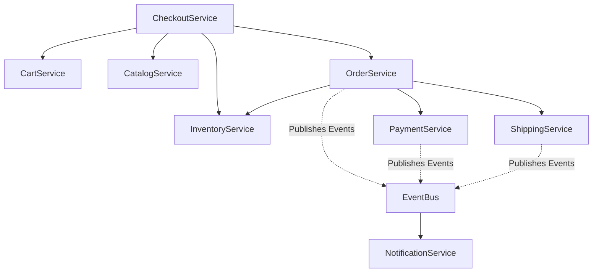

# Multi-Vendor E-Commerce Backend Architecture

This document serves as the central architectural reference for the multi-vendor e-commerce backend. It outlines the domain boundaries, request lifecycles, background operations, and the engineering principles guiding the system's evolution.

---

## 1. High-Level System Architecture

The system is built as a **Modular Monolith** using Django and Django REST Framework. The architecture emphasizes strict Domain-Driven Design (DDD) principles. 

Instead of a tightly-coupled monolithic web of dependencies, each business capability is encapsulated into its own Django App (a "Domain"). Domains expose their capabilities exclusively through thin, stateless **Service Layers**, strictly shielding their internal models and logic from external domains. Background processing and heavy network I/O are fully offloaded to a Redis + Celery worker cluster.

### 9. Technology Stack
- **Core Framework**: Django 5.2, Django REST Framework 3.17
- **Database**: PostgreSQL (or SQLite for local dev)
- **Message Broker / Cache**: Redis
- **Background Workers**: Celery, Celery Beat
- **Authentication**: JWT (JSON Web Tokens) via `djangorestframework-simplejwt`
- **API Documentation**: OpenAPI 3 via `drf-spectacular`

---

## 2. Domain Map

The system is currently divided into the following bounded contexts (completed modules):

1. **Authentication (`apps.accounts`)**: User identity, JWT authentication, RBAC (Role-Based Access Control for Buyers, Vendors, Admins).
2. **Catalog (`apps.catalog`)**: Products, Categories, Attributes, and Variants. Serves as the global product catalog.
3. **Inventory (`apps.inventory`)**: Stock management. Provides an ACID-compliant ledger for physical stock holds and permanent deductions.
4. **Shops (`apps.shops`)**: Vendor profiles, shop management, and vendor onboarding.
5. **Cart (`apps.cart`)**: Ephemeral, Redis-backed shopping cart holding unvalidated user intent.
6. **Checkout (`apps.checkout`)**: The orchestration gateway. Consumes the Cart, calculates taxes and shipping, and validates pricing/inventory to produce a financial DTO.
7. **Orders (`apps.orders`)**: The immutable ledger. Converts the Checkout DTO into a locked Order, spawning sub-orders (`VendorOrder`) for multi-vendor split fulfillment.
8. **Payments (`apps.payments`)**: The financial gateway. Manages transaction states, webhooks, and integrations with providers like Stripe, SSLCommerz, and COD.
9. **Shipping (`apps.shipping`)**: Physical fulfillment logistics. Tracks the status of packages and assigns courier strategies.
10. **Notifications (`apps.notifications`)**: The messaging hub. Centralizes SMS, Email, and In-App communications triggered by an Event Bus.

---

## 3. Service Dependency Diagram

To prevent circular dependencies, the system enforces a strict hierarchy where orchestration layers (like Checkout and Orders) call lower-level capabilities (like Inventory and Catalog), but lower-level layers *never* call upwards.



---

## 4. Domain Event Catalog

The system utilizes an explicit in-memory **Event Bus** (`apps/notifications/events.py`) to trigger asynchronous background operations without entangling domain business logic. 

| Event Class | Emitter | Action Triggered |
|-------------|---------|------------------|
| `OrderPaidEvent` | `OrderService` | Triggers Email receipt to Buyer, In-App alert to Vendor(s). |
| `ShipmentDeliveredEvent` | `ShippingService` | Triggers Delivery Confirmation to Buyer. |
| `PaymentCapturedEvent` | `PaymentService` | (Optional) specialized financial alerts. |
| `AbandonedOrderCancelledEvent` | `OrderService` | Triggers "You left items in your cart" recovery email. |

---

## 5. Request Lifecycle (The Core Purchase Flow)

The multi-vendor purchase flow represents the most complex interaction in the system, elegantly handled by domain orchestration.

1. **Cart**: Buyer adds items to their Cart. Stored ephemerally.
2. **Checkout**: 
   - Buyer initiates checkout.
   - `CheckoutService` verifies `InventoryService` for stock availability and `CatalogService` for price validity.
   - Computes multi-vendor splits, taxes, and shipping rates.
   - Produces a locked `CheckoutDTO`.
3. **Orders**: 
   - `OrderService.create_order_from_dto()` digests the DTO. 
   - Creates a master `Order` and slices it into multiple `VendorOrder`s.
   - Order remains `PENDING`.
4. **Payments**: 
   - User submits payment to `PaymentService`.
   - Webhook callback returns `SUCCESS`. `PaymentService` triggers `OrderService.mark_order_paid()`.
5. **Shipping**: 
   - `OrderService` loops through the `VendorOrder`s and triggers `ShippingService.initialize_shipment()`.
   - Vendors print labels, assign Couriers, and push the FSM forward.
6. **Notifications**: 
   - Throughout this process, domain events are published. Celery workers wake up in the background and fire off Emails and In-App messages seamlessly without delaying the buyer's HTTP requests.

---

## 6. Background Task Catalog

Tasks are cleanly isolated inside their respective domains. A central Celery Beat scheduler (`config/settings/base.py`) orchestrates the crontab.

| Task Path | Schedule | Responsibility |
|-----------|----------|----------------|
| `apps.orders.tasks.expire_abandoned_orders_task` | `*/15 * * * *` | Finds 30-min-old `PENDING` orders. Cancels them and cascades to `InventoryService` to unlock physical stock holds. |
| `apps.payments.tasks.expire_pending_payments_task` | `*/15 * * * *` | Marks stale `PENDING` webhooks as `FAILED` to close the loop. |
| `apps.accounts.tasks.cleanup_expired_tokens_task` | `0 0 * * *` | (Midnight) Hard deletes expired JWT tokens from the DB blacklist. |
| `apps.notifications.tasks.send_delivery_task` | Event-Driven | Takes a `NotificationDelivery` ID, dynamically routes to `InApp`, `Email`, or `SMS` Strategy. Implements 3x exponential backoff retries. |

---

## 7. Folder Structure Overview

```text
multi-vendor-ecommerce-backend/
├── config/                  # Global settings, WSGI, ASGI, Celery instance
│   ├── settings/
│   │   ├── base.py          # Central registry (CELERY_BEAT_SCHEDULE, INSTALLED_APPS)
│   │   └── ...
│   ├── celery.py            # Celery bootstrapper
│   └── urls.py              # Root API router
├── apps/
│   ├── common/              # Shared basemodels (UUIDModel, TimeStampedModel), exceptions
│   ├── orders/              # Orders Bounded Context
│   │   ├── services/
│   │   │   └── order.py     # Orchestration entrypoint (The Service Layer)
│   │   ├── models.py        # Order, VendorOrder, OrderItem
│   │   ├── views.py         # Thin HTTP layer
│   │   ├── tasks.py         # Domain-specific Celery tasks
│   │   └── tests/           # Full domain test isolation
│   ├── shipping/            # Shipping Bounded Context
│   │   ├── channels/        # Courier strategies
│   │   └── ...
│   └── ... (other domains)
└── manage.py
```

---

## 8. Design Principles

1. **Service Layer Pattern**: Fat models and fat views are forbidden. Controllers (Views) only handle HTTP validation. Models only handle DB constraints. All business logic exists inside static/class methods within `services/` (e.g., `OrderService`).
2. **Thin Celery Tasks**: Celery tasks contain zero business logic. They act entirely as asynchronous wrappers that fetch IDs and immediately delegate to the Service Layer, allowing business logic to be tested purely without invoking Celery.
3. **Database Transactions**: Any service layer method that writes to >1 table is strictly wrapped in `@transaction.atomic`. We utilize `.select_for_update()` aggressively to prevent race conditions during highly concurrent inventory or checkout operations.
4. **Append-Only Ledgers**: Systems like Inventory (`StockTransaction`) and Shipping (`ShipmentTrackingEvent`) do not mutate historical state. They append new events to the log, allowing perfect auditability.
5. **Strict Tenancy / Permissions**: The `views` layer strictly guards querysets. A vendor can only view/mutate data associated with their specific `Shop` ID. 

---

## 10. Future Roadmap

With the Core Commerce Loop completely finished, the project is ready to absorb auxiliary business domains. 

### Recommended Next Module: Reviews & Ratings
- **Rationale**: Currently, the platform supports multi-vendor catalog browsing and purchasing. To build buyer trust and enable algorithmic catalog sorting (e.g., "Top Rated Products", "Trusted Vendors"), a robust Review system is required. 
- **Implementation**: Needs a strict lifecycle. A Buyer should only be allowed to review a Product/Vendor if they have a successfully `COMPLETED` order for that specific SKU. This integrates directly with the existing `OrderService` state machine.
