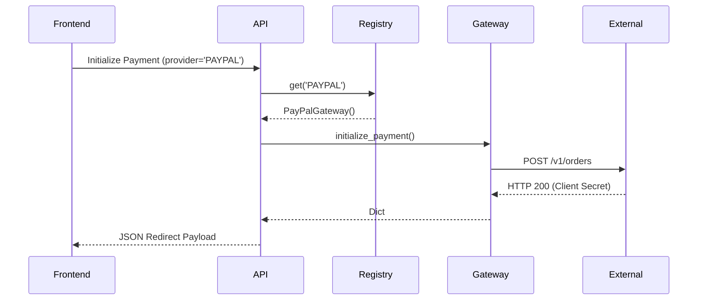

# Adding a New Payment Gateway

The Platform Foundation v1 implements an agnostic, plug-and-play **Gateway Registry** pattern. The core `PaymentService` is decoupled from all underlying payment integrations (e.g., Stripe, SSLCommerz).

To add a new payment gateway (e.g., PayPal, bKash, Razorpay), follow these exact steps without modifying `PaymentService`.

## 1. Implement the Gateway Adapter

Create a new file in `apps/payments/gateways/` (e.g., `paypal.py`).
Your class must inherit from `apps.payments.gateways.base.PaymentGateway`.

```python
from decimal import Decimal
from apps.payments.gateways.base import PaymentGateway
from apps.payments.exceptions import PaymentInitializationFailed, PaymentGatewayUnavailable

class PayPalGateway(PaymentGateway):
    def initialize_payment(self, payment_id: str, amount: Decimal, currency: str, customer_info: dict, return_url_base: str) -> dict:
        # Map domain attributes to Gateway payload
        # Ensure Decimal is safely mapped (e.g., cents or strings)
        pass

    def validate_payment(self, payload: dict) -> dict:
        # Validate webhook payload authenticity
        # Return dict matching PaymentService expectations
        pass

    def refund_payment(self, refund_id: str, payment_id: str, amount: Decimal, bank_tran_id: str = None) -> dict:
        # Process refund via gateway SDK/API
        pass
```

## 2. Register the Gateway

Open `apps/payments/apps.py` and register the new gateway instance inside the `ready()` method.

```python
def ready(self):
    from apps.payments.gateways.registry import gateway_registry
    from apps.payments.gateways.paypal import PayPalGateway
    
    # Register string 'PAYPAL' maps directly to the `provider` field on the Order payload
    gateway_registry.register('PAYPAL', PayPalGateway())
```

## 3. Handle Exceptions

Ensure that all third-party SDK or raw HTTP errors (e.g. `requests.exceptions.RequestException` or `paypalrestsdk.ResourceNotFound`) are intercepted and re-raised using Domain exceptions.

Do **NOT** leak external SDK errors to the Domain layer. 
Allowed exceptions (`apps.payments.exceptions`):
- `PaymentGatewayUnavailable`
- `PaymentValidationFailed`
- `PaymentInitializationFailed`
- `PaymentRefundFailed`

## 4. Implement Webhook Handlers

If the gateway uses asynchronous webhooks, create a standalone endpoint inside `apps/payments/api/webhooks.py`.

The webhook handler should:
1. Verify the cryptographic signature (e.g., HMAC, webhook secret).
2. Transform the payload into `payment_id`, `verified_amount`, and `provider_reference`.
3. Feed the validated data strictly to `PaymentService.process_webhook_success()` or `PaymentService.process_webhook_failure()`.

*Note: `PaymentService` is inherently idempotent. It utilizes `select_for_update()` to prevent double-processing.*

## 5. Sequence Diagram

