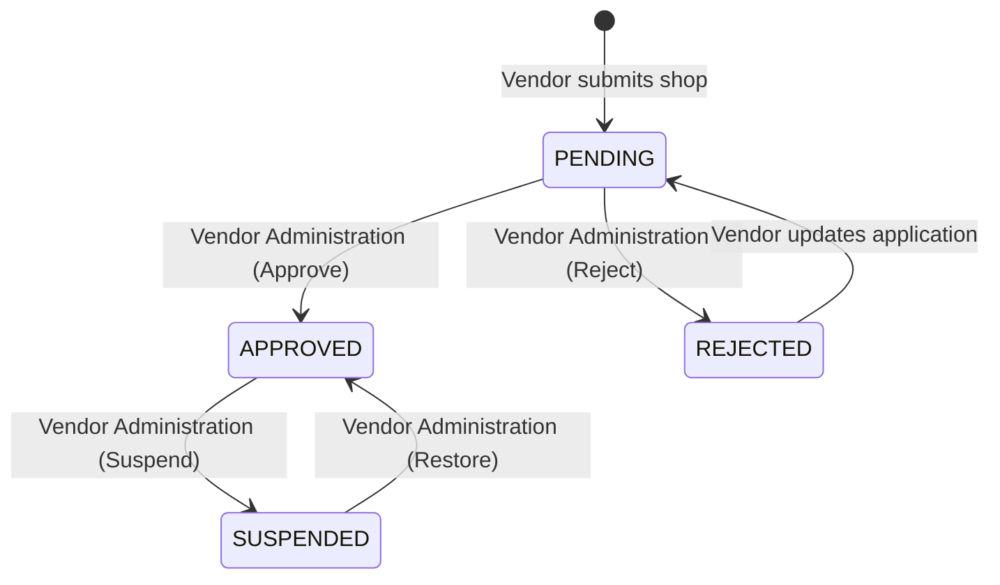

# Vendor Administration Capability

The Vendor Administration domain represents the orchestrator for all shop and vendor lifecycles on the marketplace. It enforces strict reference patterns designed around consistency, idempotency, robust observability, and immutable auditing.

## State Machine

## Workflow Diagram

For all state transitions, the Canonical Administration Workflow dictates:
1. **Permission Check**: Validate explicit role permissions.
2. **Database Transaction**: Enter `transaction.atomic()`.
3. **Domain Service Check**: Attempt the underlying change via `select_for_update`.
4. **Idempotency**: Abort side effects gracefully if the domain service reports no actual state change occurred.
5. **Audit Ledgering**: Write an immutable `AdminAuditLog` record with the explicitly mapped `action`.
6. **Observability**: Output a structured `logger.info` event.
7. **Event Distribution**: Publish a typed Domain Event via `EventBus` on `transaction.on_commit()`.

## Event Flow
All vendor lifecycle events enforce a consistent payload signature:
- `shop_id` (str)
- `vendor_id` (int)
- `actor_id` (int)
- `occurred_at` (datetime)
- `reason` (str, optional/required depending on destructiveness)

The canonical events are:
- `VendorApprovedEvent` (action: `VENDOR_APPROVED`)
- `VendorRejectedEvent` (action: `VENDOR_REJECTED`)
- `VendorSuspendedEvent` (action: `VENDOR_SUSPENDED`)
- `VendorRestoredEvent` (action: `VENDOR_RESTORED`)

## Permission Matrix
| Action  | Django Permission |
| ------------- | ------------- |
| Approve Shop  | `administration.can_approve_vendor` |
| Reject Shop   | `administration.can_reject_vendor` |
| Suspend Shop  | `administration.can_suspend_vendor` |
| Restore Shop  | `administration.can_restore_vendor` |

## Workflow Coverage Matrix
| Verification | Approve | Reject | Suspend | Restore |
| ------------ | ------- | ------ | ------- | ------- |
| **Permission** | ✓ | ✓ | ✓ | ✓ |
| **Invalid Transition** | ✓ | ✓ | ✓ | ✓ |
| **Idempotency** | ✓ | ✓ | ✓ | ✓ |
| **Audit** | ✓ | ✓ | ✓ | ✓ |
| **Event** | ✓ | ✓ | ✓ | ✓ |
| **API** | ✓ | ✓ | ✓ | ✓ |
| **Transaction Rollback** | ✓ | ✓ | ✓ | ✓ |
| **Concurrency** | ✓ | N/A* | N/A* | N/A* |

*\*Concurrency tested manually in `ShopService` implementation via `select_for_update()`; full multi-threaded sqlite testing skipped due to explicit thread locking instability.*
