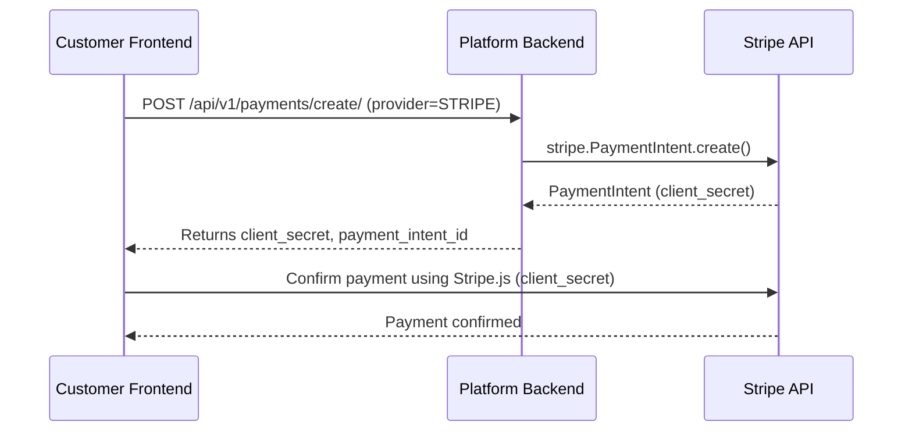
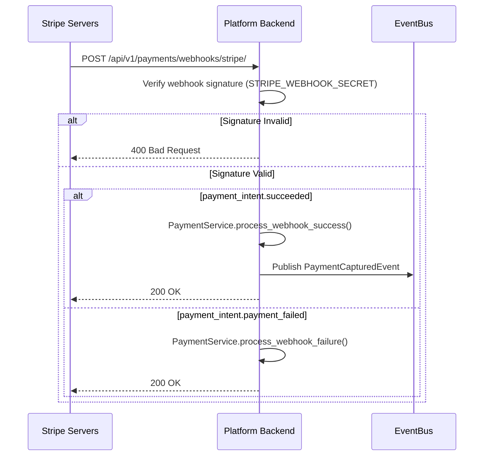

# Stripe Payment Gateway - Operational Runbook

## 1. Architecture Summary
The Stripe integration is implemented as an Infrastructure Adapter implementing the core `PaymentGateway` interface. It is registered via the `GatewayRegistry` (`STRIPE`). The core `PaymentService` resolves it dynamically. The integration relies strictly on the official `stripe` Python SDK and uses `PaymentIntents` for processing checkout payloads and webhook signatures for authenticity validation. No card details ever touch our backend servers (Stripe.js must be used on the frontend).

## 2. Endpoint List
| Endpoint | Method | Purpose |
|----------|--------|---------|
| `/api/v1/payments/create/` | `POST` | Triggers `PaymentService.initialize_payment` returning a Stripe `client_secret`. |
| `/api/v1/payments/webhooks/stripe/` | `POST` | Official endpoint to receive Stripe asynchronous webhook payloads. |

## 3. Environment Variables
The following environment variables must be defined in your `.env` or CI/CD secrets:
```env
# Stripe Sandbox (Test Mode) Keys
STRIPE_SECRET_KEY="sk_test_..."
STRIPE_PUBLISHABLE_KEY="pk_test_..."
STRIPE_WEBHOOK_SECRET="whsec_..."
STRIPE_TEST_MODE="True"
```

## 4. Payment Sequence Diagram


## 5. Webhook Flow Diagram


## 6. Testing Summary
Comprehensive testing is implemented using `unittest.mock` inside `apps/payments/tests/test_stripe.py`. The suite intercepts calls to the Stripe SDK (`stripe.PaymentIntent.create`, `stripe.PaymentIntent.retrieve`, `stripe.Refund.create`) to ensure:
- Appropriate data mapping (e.g. converting Decimal to cents).
- Correct exception handling (`stripe.error.StripeError` -> `PaymentGatewayUnavailable` / `PaymentValidationFailed`).
- Successful execution without invoking network requests.

## 7. Security Review
- **Webhook Authenticity:** Every incoming request to `/api/v1/payments/webhooks/stripe/` is cryptographically validated using `stripe.Webhook.construct_event`. Fake payloads fail immediately.
- **Data Isolation:** Credit card information never touches our servers. The backend only handles UUID `payment_id` and `client_secret`.
- **Idempotency:** Re-delivered webhooks are mitigated inherently by `PaymentService.process_webhook_success()` obtaining a database lock via `select_for_update()` and halting if the `Payment.status` is already `CAPTURED`.

## 8. Operational Runbook

### Handling Webhook Failures
If Stripe dashboard reports webhook delivery failures:
1. Verify `STRIPE_WEBHOOK_SECRET` matches the endpoint registered in the Stripe Dashboard.
2. Check backend application logs for `Stripe Webhook Error:` prefixes.
3. If errors are "Invalid signature", the secret is rotated or mismatched.

### Manual Refund Handling
If a refund fails in the system but needs to be executed manually:
1. Process the refund via the Stripe Dashboard using the `payment_intent_id`.
2. Stripe will fire a `charge.refunded` webhook. Although our platform handles refunds synchronously, the webhook confirms the state. If necessary, execute a Django shell command:
```python
from apps.payments.services.payment import PaymentService
PaymentService.process_refund(payment_id="pay_uuid", amount=Decimal("..."))
```

### Rate Limiting
If you encounter `StripeGatewayUnavailable` due to Stripe Rate Limits (HTTP 429), it means the system is peaking above 100 read/write operations per second to Stripe. Implement a Celery retry mechanism with exponential backoff on `process_refund` and initialization logic if this occurs frequently.
